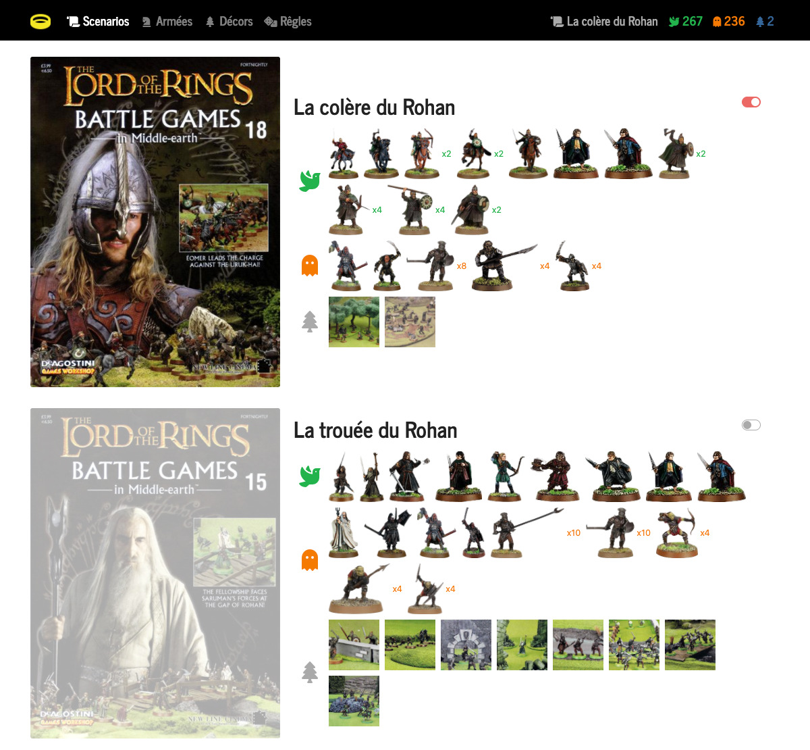

<p align="center">
    
</p>
<p align="center">
    Companion for <a href="https://en.wikipedia.org/wiki/Battle_Games_in_Middle-earth">Battle Games in Middle-earth</a>.<br>
</p>
<p align="center">
    Demo available at https://sdagw.dubandubois.com
</p>

## Status

This application is now considered as stable.
No more features are planned, but feel free to suggest some if you need.
Documentation, feature, fix, UX, logo, translation... any help is welcome !

## Features...

### ....for end users

- rule generator based on the selected figurines and sceneries.
- scenario, figurine, scenery and rule data from the magazines.
- scenarios selection to select all involved figurines and sceneries at once.
- individual figurine selection for custom matches.
- individual scenery selection for custom matches.
- army value calculation for each force.
- support for multiple versions of the same hero.
- responsive design.
- multi language (currently supported: French).

### ...for administrator

- data stored in json (or alike) format for easier maintainability.

## Requirements

- a web server (tested with Apache).

## Deployment

1. Download the code to an empty folder:
```bash
git clone https://github.com/simondubois/sdagw.git /var/www/sdagw
```
2. Install the dependencies:
```bash
cd /var/www/sdagw && npm run install
```
3. Build the frontend assets:
```bash
npm run build
```
4. Point the web server to `/var/www/sdagw/dist`.
